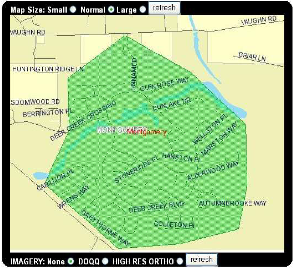

### How Open Source GIS Helps Prevent Excavation Damage in Alabama

Matt Brown

Operations and Technology Director

Alabama 811

Note:
 - explain what Alabama 811 does
 - set up video(a day in the dark)
 - produced by CGA - Common Ground Alliance (creator of 811 idea)
---

---
### More about Alabama 811...
- In operation since 1975
- Operating as Alabama 811 since 2011
- Located in Fultondale, AL
- 25 Employees

Note:
- 15 Call Center Agents

---

### Operating Statistics

#### 2003
- 367,831 Locate Requests Received
- 2,528,788 Requests Sent to Member Utilities
- 221,978 Phone Calls

---

#### 2017
- 585,316 Locate Requests
- 5,037,734 Requests Sent to Member Utilities
- 206,498 Phone Calls

---

## What About GIS?

---
### Current FOSS4G Stack 

#### GeoCall

- Progressive Partnering
- 11 State One Call Centers
- Integrated GIS - Openlayers, Mapserver, Mapcache, Postgis
- Cloud Hosted (Azure)

---

### Infrastructure
- 2 Load Balanced Windows Servers
- 2 Linux Postgres Servers
- Azure SQL Server 

---

## Demo Time!

---

### How we started with FOSS4G
- Geocall - Desktop Application - Mapobjects
- Arcmap for Data management
- Tried Manifold for Web Maps
- 2004 - Mapserver based Service Area Editor

---

---

## Thank You / Questions

mbrown@al811.com

205.731.3202

@mattbrowngis

